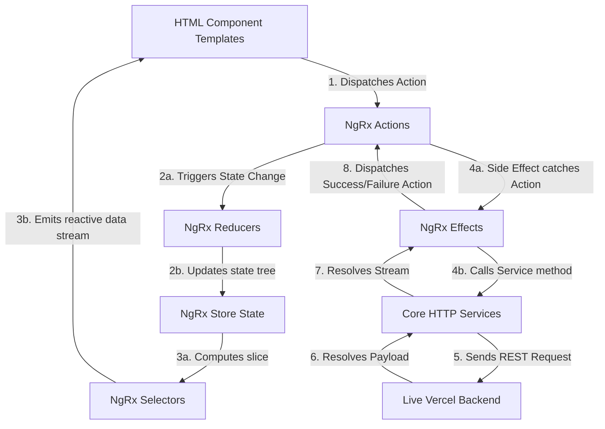

# 🏗️ M3allem Platform — Frontend Architecture & Technical Blueprint

Welcome to the central architectural blueprint for **M3allem Platform** (معلم) — a high-performance, bilingual (Arabic & English) home services marketplace built with Angular 17 and NgRx. 

This repository brings together foundational UI libraries, singleton core operations, and state-driven business modules to match local service providers (**Workers** and **Companies**) with **Clients** (represented as `user` role in the backend).

---

## 🎯 Technical Stack & Principles

1. **Framework**: Angular 17 (Module-based structure) leveraging strong TypeScript models.
2. **State Management**: **NgRx Suite** (`@ngrx/store`, `@ngrx/effects`, `@ngrx/entity`, `@ngrx/router-store`) governing global reactive state with standard Actions → Reducers → Selectors patterns.
3. **HTTP & API Integration**: Reactive RxJS-driven HTTP calls utilizing custom token-injecting interceptors pointing to the live production server at `https://maallem-backend.vercel.app/api/v1`.
4. **Design System**: A curated, harmonize HSL design system using clean CSS variables and custom components. **No TailwindCSS** — maximum custom CSS flexibility is achieved through scoped vanilla styling.
5. **Component Library Strategy**: A local, shared monorepo workspace structure divided into:
   - `@m3allem/ui-kit`: A headless/atomic, styled core library (located in `libs/ui-kit`).
   - Shared Modules: Contextual reusable widgets (located in `src/app/shared`).
   - Features: Lazy-loaded transactional views (located in `src/app/features`).

---

## 📁 Repository Directory Architecture

```
m3allem-project/
├── libs/
│   └── ui-kit/                    # 📦 Atomic UI Kit Library (@m3allem/ui-kit)
│       └── src/
│           ├── button/            # Primary/Secondary buttons with loading indicators
│           ├── chip/              # Filter, tag, and status display chips
│           ├── input/             # Form control value accessor input fields
│           ├── modal/             # Keyboard-accessible overlays with focus traps
│           ├── select/            # Scoped native-like select drop-downs
│           ├── spinner/           # Pure CSS SVG loading icons
│           └── toast/             # Reactive toast notification alert manager
│
├── src/
│   ├── app/
│   │   ├── core/                  # 🛡️ Singleton Architecture (Only imported in AppModule)
│   │   │   ├── auth/              # AuthService (login, register, token refresh)
│   │   │   ├── guards/            # Navigation role and authentication guards
│   │   │   ├── interceptors/      # HttpInterceptor adding Bearer auth headers
│   │   │   ├── models/            # Domain interfaces mapped to database schemas
│   │   │   └── services/          # Singleton communication APIs (REST & WebSockets)
│   │   │
│   │   ├── shared/                # 🤝 Shared Contextual Elements (Imported per feature)
│   │   │   ├── components/        # Compound widgets (Avatar, StarRating, WorkerCard, etc.)
│   │   │   ├── directives/        # DOM utility directives (hasRole, clickOutside)
│   │   │   ├── pipes/             # Formatting pipes (timeAgo, currencyFormat, truncate)
│   │   │   └── shared.module.ts   # Core export manager of shared tools
│   │   │
│   │   ├── features/              # 🧭 Feature Areas (100% Lazy-Loaded Pages)
│   │   │   ├── customer/          # Portals for clients to post jobs and view offers
│   │   │   ├── worker/            # Dashboards for browsing jobs and submitting proposals
│   │   │   ├── admin/             # Console for user status control and disputes
│   │   │   ├── rewards/           # Progression metrics for loyalty level tiers
│   │   │   ├── services/          # Standard calendars, booking pages, and success screens
│   │   │   ├── home/              # General landings and public marketplaces
│   │   │   ├── chat/              # Real-time message exchange portals
│   │   │   └── notifications/     # Full alert feeds
│   │   │
│   │   └── layouts/               # 🏛️ App Shell Templates
│   │       ├── auth-layout/       # Plain canvas screen for login/signup
│   │       └── user-layout/       # Shell with sticky header navigation and sidebar feeds
│   │
│   └── environments/              # ⚙️ Host API configurations
```

---

## 🔄 Core Data & State Flow

The platform relies heavily on **unidirectional reactive data flow** to manage transactional interactions:



---

## 🔑 Role & Permissions System

M3allem enforces fine-grained permissions at both the navigation guard and template levels.

### The `UserRole` Enum
```typescript
export enum UserRole {
  CUSTOMER = 'user',    // General client/poster role in backend
  WORKER   = 'worker',  // Service technician/provider role
  COMPANY  = 'company', // Corporate service contractor role
  ADMIN    = 'admin',   // Global platform moderator
}
```

### 1. Guard Level (Page Protection)
Lazy-loaded module routes inside `app.routing.module.ts` are guarded by role validators (`AuthGuard`, `CustomerGuard`, `WorkerGuard`, `AdminGuard`):
```typescript
{
  path: 'customer',
  loadChildren: () => import('./features/customer/customer.module').then(m => m.CustomerModule),
  canActivate: [AuthGuard, CustomerGuard]
}
```

### 2. Template Level (Conditional Layouts)
The custom directive `*hasRole` dynamically hides/reveals elements in the layout:
```html
<!-- Visible only to service providers -->
<div *hasRole="['worker', 'company']">
  <button app-button (click)="openJobs()">Browse Jobs</button>
</div>
```

---

## 🔄 Backend API Mapping & Integration

The frontend maps domain logic onto a structured Mongo-Express backend. The core components map directly to endpoints:

| Frontend Concept | Mapped Service | REST Routes | Roles Allowed |
| :--- | :--- | :--- | :--- |
| **Authentication** | `AuthService` | `/auth/register`<br>`/auth/login`<br>`/auth/me`<br>`/auth/refresh-token` | Public / Logged-in |
| **Worker Profiles** | `WorkerProfileService` | `GET /profiles/workers`<br>`GET /profiles/workers/{id}`<br>`GET/POST/PUT/DELETE /profiles/worker/me` | Public / Worker |
| **Company Profiles** | `CompanyProfileService` | `GET /profiles/companies`<br>`GET /profiles/companies/{id}`<br>`GET/POST/PUT/DELETE /profiles/company/me` | Public / Company |
| **Projects (Jobs)** | `ProjectService` | `GET /projects`<br>`GET /projects/{id}`<br>`POST/PUT/DELETE /projects/{id}`<br>`PATCH /projects/{id}/status` | Public / Client |
| **Proposals (Bids)** | `ProposalService` | `GET /projects/{id}/proposals`<br>`POST /projects/{id}/proposals`<br>`GET /proposals/my`<br>`PUT/DELETE /proposals/{id}`<br>`PATCH /proposals/{id}/status` | Client / Worker |

*Note: Stubs exist for **Reviews**, **Rewards**, and **Notifications** to support local state mock logic while their backend counterparts are fully deployed.*

---

## 🇸🇦 Bilingual Support & Arabic Localization

The platform is designed to cater deeply to Arabic-speaking clients and providers in Egypt and the MENA region.
1. **Dynamic Field Structures**: Models like `ServiceCategory` support bilingual labels:
   ```typescript
   export interface ServiceCategory {
     id: string;
     name: string;   // English Display (e.g. "Plumbing")
     nameAr: string; // Arabic Display (e.g. "سباكة")
     slug: string;
     isActive: boolean;
   }
   ```
2. **Contextual Directionality**: Scoped layouts automatically accommodate RTL styling for Arabic viewports and LTR layout frameworks seamlessly.
3. **Egypt Locale Formats**: Currency format pipes utilize Arabic defaults (`EGP 450`) to display rates familiar to local workforces.

---

## 👥 Collaborative Pipeline (Team Engineers Guide)

To avoid conflicts during merge cycles, development is divided cleanly:

* **👷 Engineer 1 (Core Foundations & UI Kit)**: 
  - Owns `libs/ui-kit/` atomic components.
  - Owns `src/app/shared/components/` and shared layout pipes.
  - *Golden Rule*: Do not add server communication to shared UI kits. Keep them presentational and functional.
* **👷 Engineer 2 (Authentication & Public Profiles)**:
  - Owns user login layouts, public profiles listing, and user account settings features (`/profiles/workers`, `/profiles/companies`, `/auth`).
  - *Golden Rule*: Always coordinate changes to token and session management inside the interceptors.
* **👷 Engineer 3 (State Core, Dashboards & Platforms)**:
  - Owns the core state (`Store/`), project posting pipelines, worker bids (`/projects`, `/proposals`), customer/worker dashboards, rewards progressions, and notifications pipelines.
  - *Golden Rule*: Maintain wrappers like `BookingService` and `BidService` to translate the frontend tasks easily onto the live backend API calls without breaking other developers' branch merges.
