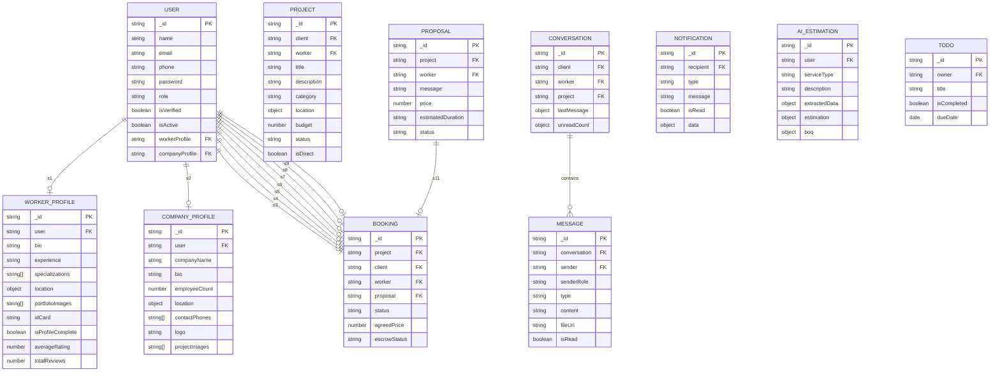

Information Technology Institute (ITI)

Full Stack Development Track

**Maallem**

*An On-Demand Home Services & E-Commerce Marketplace*

Graduation Project

Submitted as a requirement for the Graduation Project Track

**Presented By:**

\[Team Member 1\]

\[Team Member 2\]

\[Team Member 3\]

\[Team Member 4\]

\[Team Member 5\]

**Supervised by:**

\[Supervisor Name\]

Egypt

2026

---

# Table of Contents

[Acknowledgement [2](#acknowledgement)](#acknowledgement)

[Project Overview [3](#project-overview)](#project-overview)

[Project Scope [4](#project-scope)](#project-scope)

[Chapter 1 [5](#chapter-1)](#chapter-1)

[Introduction [5](#introduction)](#introduction)

[Background — The Home Services & Skilled Trades Market [5](#background)](#background)

[Problem Statement [5](#problem-statement)](#problem-statement)

[Objectives [5](#objectives)](#objectives)

[Chapter 2 [6](#chapter-2)](#chapter-2)

[Requirements Analysis and System Development [6](#requirements-analysis-and-system-development)](#requirements-analysis-and-system-development)

[2.1 Functional Requirements [6](#21-functional-requirements)](#21-functional-requirements)

[2.1.1 User, Worker & Company Management [6](#211-user-worker--company-management)](#211-user-worker--company-management)

[2.1.2 Authentication & Authorization [6](#212-authentication--authorization)](#212-authentication--authorization)

[2.1.3 Project & Proposal Workflow [7](#213-project--proposal-workflow)](#213-project--proposal-workflow)

[2.1.4 AI Features: Q-Scale BOQ & Worker Recommendations [7](#214-ai-features-q-scale-boq--worker-recommendations)](#214-ai-features-q-scale-boq--worker-recommendations)

[2.1.5 Real-Time Communication (Chat & Pusher) [8](#215-real-time-communication-chat--pusher)](#215-real-time-communication-chat--pusher)

[2.1.6 E-Commerce Module (M3allem Store) [8](#216-e-commerce-module-m3allem-store)](#216-e-commerce-module-m3allem-store)

[2.1.7 Rewards & Master Programme [8](#217-rewards--master-programme)](#217-rewards--master-programme)

[2.1.8 Notifications & Task Management [9](#218-notifications--task-management)](#218-notifications--task-management)

[2.1.9 Booking & Escrow Workflow [9](#219-booking--escrow-workflow)](#219-booking--escrow-workflow)

[2.1.10 Administrator Functionality [9](#2110-administrator-functionality)](#2110-administrator-functionality)

[2.2 Non-Functional Requirements [9](#22-non-functional-requirements)](#22-non-functional-requirements)

[2.2.1 User Interface [9](#221-user-interface)](#221-user-interface)

[2.2.2 Security [10](#222-security)](#222-security)

[2.2.3 Scalability [10](#223-scalability)](#223-scalability)

[2.2.4 Performance [10](#224-performance)](#224-performance)

[System Development [10](#system-development)](#system-development)

[2.3 Introduction [10](#23-introduction)](#23-introduction)

[2.3.1 Tools & Technologies [11](#231-tools--technologies)](#231-tools--technologies)

[2.4 Integration of Technologies [11](#24-integration-of-technologies)](#24-integration-of-technologies)

[Chapter 3 [12](#chapter-3)](#chapter-3)

[System Design [12](#system-design)](#system-design)

[3.0 System Architecture Overview [12](#30-system-architecture-overview)](#30-system-architecture-overview)

[3.1 Frontend Module Architecture [12](#31-frontend-module-architecture)](#31-frontend-module-architecture)

[3.2 Backend Architecture (MERN / Node.js + Express) [13](#32-backend-architecture-mern--nodejs--express)](#32-backend-architecture-mern--nodejs--express)

[3.3 Core Data & State Flow (NgRx) [13](#33-core-data--state-flow-ngrx)](#33-core-data--state-flow-ngrx)

[3.4 Role & Permissions System [14](#34-role--permissions-system)](#34-role--permissions-system)

[3.5 AI System Design [14](#35-ai-system-design)](#35-ai-system-design)

[3.5.1 Introduction [14](#351-introduction)](#351-introduction)

[3.5.2 Worker Recommendations AI Pipeline [14](#352-worker-recommendations-ai-pipeline)](#352-worker-recommendations-ai-pipeline)

[3.5.3 Q-Scale (BOQ) AI Pipeline [15](#353-q-scale-boq-ai-pipeline)](#353-q-scale-boq-ai-pipeline)

[3.5.4 Comparison: Q-Scale vs. Recommendations [15](#354-comparison-q-scale-vs-recommendations)](#354-comparison-q-scale-vs-recommendations)

[3.6 Database Design [15](#36-database-design)](#36-database-design)

[3.6.1 Introduction [15](#361-introduction)](#361-introduction)

[3.6.2 Entity Descriptions [15](#362-entity-descriptions)](#362-entity-descriptions)

[3.6.3 Relationship Diagrams (ERD) [16](#363-relationship-diagrams-erd)](#363-relationship-diagrams-erd)

[3.7 E-Commerce Subsystem Design [17](#37-e-commerce-subsystem-design)](#37-e-commerce-subsystem-design)

[3.8 UI Design System [17](#38-ui-design-system)](#38-ui-design-system)

[3.9 Advantages of the Architecture [17](#39-advantages-of-the-architecture)](#39-advantages-of-the-architecture)

[Chapter 4 [18](#chapter-4)](#chapter-4)

[Testing and Deployment [18](#testing-and-deployment)](#testing-and-deployment)

[4.1 Testing [18](#41-testing)](#41-testing)

[4.2 Unit Testing [18](#42-unit-testing)](#42-unit-testing)

[4.3 Integration Testing [18](#43-integration-testing)](#43-integration-testing)

[4.4 System Testing [19](#44-system-testing)](#44-system-testing)

[4.5 User Acceptance Testing (UAT) [19](#45-user-acceptance-testing-uat)](#45-user-acceptance-testing-uat)

[4.6 Testing Strategy & Rationale [19](#46-testing-strategy--rationale)](#46-testing-strategy--rationale)

[4.7 Deployment [19](#47-deployment)](#47-deployment)

[4.8 Server & Environment Setup [19](#48-server--environment-setup)](#48-server--environment-setup)

[4.9 Security Hardening [19](#49-security-hardening)](#49-security-hardening)

[4.10 Application Deployment [20](#410-application-deployment)](#410-application-deployment)

[4.11 API Reference — Core Service Endpoints [20](#411-api-reference--core-service-endpoints)](#411-api-reference--core-service-endpoints)

[4.12 API Reference — E-Commerce Store Endpoints [21](#412-api-reference--e-commerce-store-endpoints)](#412-api-reference--e-commerce-store-endpoints)

[4.13 Additional Considerations [21](#413-additional-considerations)](#413-additional-considerations)

[4.14 Post-Deployment Tasks [21](#414-post-deployment-tasks)](#414-post-deployment-tasks)

[4.15 Application Screenshots [22](#415-application-screenshots)](#415-application-screenshots)

[Chapter 5 [22](#chapter-5)](#chapter-5)

[AI-Powered Features Deep Dive [22](#ai-powered-features-deep-dive)](#ai-powered-features-deep-dive)

[Purpose of the AI Module [22](#purpose-of-the-ai-module)](#purpose-of-the-ai-module)

[Q-Scale (BOQ) Conversational Slot Filling Refactor [22](#q-scale-boq-conversational-slot-filling-refactor)](#q-scale-boq-conversational-slot-filling-refactor)

[Backend Changes: Conversational Architecture [23](#backend-changes-conversational-architecture)](#backend-changes-conversational-architecture)

[Security [23](#security-3)](#security-3)

[Testing [23](#testing-1)](#testing-1)

[Deployment [23](#deployment-1)](#deployment-1)

[Maintenance and Updates [23](#maintenance-and-updates)](#maintenance-and-updates)

[Conclusion [24](#conclusion)](#conclusion)

[Chapter 6 [24](#chapter-6)](#chapter-6)

[Maintenance, Support and Conclusion [24](#maintenance-support-and-conclusion)](#maintenance-support-and-conclusion)

[Conclusion [24](#conclusion-1)](#conclusion-1)

[Key Takeaways [24](#key-takeaways)](#key-takeaways)

[Future Work [25](#future-work)](#future-work)

[Planned Feature Enhancements [25](#planned-feature-enhancements)](#planned-feature-enhancements)

[Scalability & Infrastructure Improvements [25](#scalability--infrastructure-improvements)](#scalability--infrastructure-improvements)

[Additional AI Capabilities [25](#additional-ai-capabilities)](#additional-ai-capabilities)

[Mobile Application Extension [26](#mobile-application-extension)](#mobile-application-extension)

[Table of References [27](#table-of-references)](#table-of-references)

---

# Acknowledgement

We would like to express our sincere gratitude to the Information Technology Institute (ITI) and our supervisor, \[Supervisor Name\], for their continuous guidance and unwavering support throughout the development of the Maallem platform. Their expertise helped us navigate the complexities of building a full-stack, bilingual, AI-powered marketplace from the ground up. We also thank our families, colleagues, and everyone who participated in user-testing sessions for their encouragement and invaluable feedback during this graduation project cycle.

---

# Project Overview

Maallem (معلّم) is a bilingual (Arabic & English) platform with **two complementary commercial pillars**: a **home services marketplace** connecting Clients (homeowners and tenants) with verified Workers (individual tradespeople) and Companies (corporate contractors), and an integrated **E-Commerce module** (M3allem Store) enabling those same Workers and Companies to sell the trade materials their services require — creating a unified supply-and-labor experience for the Egyptian and MENA home improvement market.

The service marketplace covers six trade categories: demolition/alteration, masonry/building, painting, plumbing, electrical, and carpentry. Clients post jobs, Workers submit competitive bids, and the platform manages the full lifecycle from proposal through booking confirmation and escrow. The E-Commerce module runs as a separately deployed but deeply integrated store, where a Worker's AI-generated Bill of Quantities (BOQ) from the Q-Scale system can serve as a direct shopping list in the store — closing the loop between *scope estimation* and *materials procurement* within a single platform.

The platform's differentiating AI capability is a two-pronged module: a **Worker Recommendations engine** (using `gemini-2.5-flash` to parse informal Egyptian Arabic problem descriptions and match users to verified workers), and a **Q-Scale (BOQ) engine** (a hybrid conversational slot-filling + deterministic calculation pipeline that generates professionally structured Bills of Quantities — eliminating LLM hallucination in pricing math by separating language understanding from computation).

The system is implemented as a decoupled three-tier application: a **MERN-stack backend** (MongoDB, Express.js, Node.js) deployed on Vercel at `https://maallem-backend.vercel.app/api/v1`; a standalone **E-Commerce API** at `https://m3allem-store-dashboard.vercel.app`; and an **Angular 17 single-page application** using NgRx for global state management, a custom HSL-based CSS design system, and a reusable `@m3allem/ui-kit` component library.

---

# Project Scope

The table below defines what is in scope for the delivered graduation project versus what remains out of scope, deferred to Future Work in Chapter 6. This reflects the actual codebase, not any original strategic proposal.

| **Area** | **In Scope (Implemented)** | **Out of Scope (Not Implemented)** |
| --- | --- | --- |
| Identity & Roles | JWT registration/login, token refresh, three roles (user/worker/company), admin role | SSO/OIDC, email verification, two-factor authentication |
| Worker & Company Profiles | Full CRUD profile management with multipart image upload (Cloudinary), portfolio galleries, reviews | Profile verification/badge system, background checks |
| Projects & Proposals | Client job posting, public listing, direct-to-worker requests, worker proposal submission & lifecycle | Automated matching/dispatch, guaranteed response SLA |
| AI — Worker Recommendations | `gemini-2.5-flash` intent & location extraction, Mongoose DB query, city-fallback resiliency | Geo-radius search, semantic embeddings for worker ranking |
| AI — Q-Scale (BOQ) | Gemini 2.5 Flash conversational slot filling, deterministic civil engineering formulas, SKU mapping | Multi-trade combined BOQ, supplier pricing integrations |
| Real-Time Chat | Pusher-backed private channels, text/image/file messages, conversation threading, unread counts | Voice/video calls, end-to-end encryption |
| Bookings & Escrow | Booking creation, agreement status lifecycle, escrow payment flow | Third-party payment gateway integration (Paymob/Stripe) |
| E-Commerce Store | Product CRUD, category management, order lifecycle, seller dashboard | Cart/wishlist, payment integration, shipping tracking |
| Rewards Programme | Tier system (Bronze/Silver/Gold/Master), point history, tier progress display | Automated point triggers from completed jobs |
| Notifications | Pusher-driven real-time in-app notifications, read/delete, unread count | Push notifications (FCM/APNs), email digests |
| Task Management | Personal todos/tasks CRUD for logged-in users | Project-linked task boards, team assignments |
| Admin Panel | User management, status control, dispute visibility | Platform-wide analytics, content moderation tools |
| Testing & Deployment | Manual testing via Postman/Swagger UI; Vercel deployment | Automated test suite, Docker containerization, CI/CD |

---

# Chapter 1

# Introduction

This chapter introduces the business context that motivates Maallem, states the problems the platform is designed to solve, and lists the graduation project's measurable objectives.

## Background

The home services and skilled trades sector in Egypt and the wider MENA region suffers from a persistent information asymmetry: homeowners and property managers cannot easily discover, vet, or price verified tradespeople; while skilled craftsmen — electricians, plumbers, carpenters, and construction workers — depend almost exclusively on word-of-mouth and informal referrals to find work. This market fragmentation creates several compounding inefficiencies: clients overpay due to lack of price transparency; workers have unstable income streams due to uneven demand distribution; and rogue or unqualified contractors operate without accountability because there is no centralized reputation system.

Additionally, the BOQ (Bill of Quantities) estimation process — a prerequisite for any construction or renovation project — is overwhelmingly manual, error-prone, and inaccessible to the average homeowner. Hiring a quantity surveyor for a small domestic project is cost-prohibitive, and informal estimates from contractors are frequently inaccurate and self-serving.

## Problem Statement

The Maallem platform targets five compounding problems: (1) **discovery friction** — clients have no reliable way to search, filter, and compare verified tradespeople in their city; (2) **trust deficit** — there is no persistent reputation layer (ratings, portfolio, ID verification) for tradespeople operating in the informal economy; (3) **pricing opacity** — clients cannot obtain independent, objective cost estimates for home improvement tasks without engaging a contractor first; (4) **language barrier** — most existing service-matching platforms are English-first, creating a significant adoption gap for an Arabic-speaking market; and (5) **disjointed supply chain** — the materials needed for a job are sourced separately from the labor, requiring clients to coordinate two independent procurement streams. Maallem is designed to address all five problems directly through its marketplace, AI estimation, bilingual design, and integrated e-commerce module.

## Objectives

-   Provide a multi-role platform where Clients, Workers, and Companies operate within clearly separated portal experiences, each scoped to their appropriate permissions and data.

-   Enable Clients to post job projects (open or direct-to-worker), review incoming Worker proposals, and manage the full engagement lifecycle through to booking confirmation.

-   Deploy an AI-powered Worker Recommendations system that parses informal Arabic/Egyptian-slang problem descriptions and returns a ranked list of verified matching workers filtered by trade specialization and city.

-   Deploy a Q-Scale (BOQ) AI system that uses a hybrid conversational extraction + deterministic engineering formula pipeline to produce accurate, hallucination-free material quantity estimates and pricing for all six supported trade categories.

-   Implement real-time, bidirectional chat between Clients and Workers using Pusher-backed private channels with support for text, image, and file messages.

-   Provide a rewards and tier progression system (Bronze → Silver → Gold → Master) that incentivizes Workers to build quality reputations and complete higher-value engagements.

-   Offer an integrated e-commerce store where workers and companies can sell trade-relevant products, with category management, order processing, and a seller dashboard.

-   Deliver the entire platform with deep Arabic localization — bilingual UI labels, RTL-aware layouts, Egyptian currency formatting, and AI prompts written in Egyptian Arabic slang.

---

# Chapter 2

# Requirements Analysis and System Development

## 2.1 Functional Requirements

### 2.1.1 User, Worker & Company Management

The platform models three primary actor roles within a shared `User` MongoDB document: `user` (Client/homeowner), `worker` (individual tradesperson), and `company` (corporate contractor). A fourth `admin` role provides platform-level oversight. The `User` schema stores `name`, `email`, `phone`, `password` (bcrypt-hashed), `role`, `isVerified`, `isActive`, and optional references to a linked `WorkerProfile` or `CompanyProfile` document.

`WorkerProfile` extends the user identity with trade-specific fields: `bio`, `experience`, `specializations` (string array mapping to the six core trade categories), `location` (structured with `address`, `city`, and an optional GeoJSON `coordinates` point), `phone`, `knownWorkerName`, `portfolioImages` (Cloudinary URLs, max 10), `idCard` (required for verification), `isProfileComplete`, `averageRating`, `totalReviews`, and a `recentReviews` sub-array.

`CompanyProfile` mirrors this structure for corporate actors: `companyName`, `bio`, `employeeCount`, `location`, `contactPhones`, `logo`, `projectImages`, and `isProfileComplete`.

All profile create/update operations accept `multipart/form-data` to handle binary file uploads (avatar, logo, idCard, portfolio images) processed through Cloudinary. A `removePortfolioImages` field on update requests allows selective deletion of previously uploaded Cloudinary assets.

### 2.1.2 Authentication & Authorization

Authentication uses JWT Bearer tokens with a refresh-token rotation pattern. `POST /api/v1/auth/register` creates a new User, issues an `accessToken` and `refreshToken`, and returns the full user object. `POST /api/v1/auth/login` validates credentials and issues fresh token pairs. `POST /api/v1/auth/refresh-token` atomically rotates the refresh token. `POST /api/v1/auth/logout` invalidates the supplied refresh token server-side.

`GET /api/v1/auth/me` returns the current user's profile (populated with any linked Worker or Company profile references) and is the frontend's authoritative session-check endpoint. The Angular `AuthGuard` calls this endpoint on route activation when no decoded JWT is found in `TokenStorageService`, falling back to a redirect to `/auth/login`.

Role-based access is enforced at the route level by four dedicated Angular guards:

| **Guard** | **Roles Permitted** | **Applied to Routes** |
| --- | --- | --- |
| `AuthGuard` | Any authenticated user | `/services`, `/notifications`, `/tasks`, `/chat`, `/profile` |
| `CustomerGuard` | `user` role only | `/customer/**` (job posting, bid review, client dashboard) |
| `WorkerGuard` | `worker` or `company` role | `/worker/**` (worker dashboard, bids, profile), `/rewards/**` |
| `AdminGuard` | `admin` role only | `/admin/**` (user management, dispute console) |
| `MasterGuard` | Worker who opted into Master | `/master/**` (lesson creation, student management) |

### 2.1.3 Project & Proposal Workflow

A **Project** is the central transactional entity representing a client's service request. Key fields: `client` (User ref), `worker` (targeted User ref, nullable), `title`, `description`, `category` (maps to one of the six trade types), `location` (address + city + GeoJSON point), `budget`, `invoiceImage`, `status` (`open` | `in-progress` | `closed`), and `isDirect` (boolean flag for private worker-targeted requests).

Projects support two creation modes: **open listing** (visible in the public `/projects` feed, open to any worker proposal) and **direct request** (sent to a specific worker by `workerId`, sets `isDirect=true`, not shown in public listing). When a client creates a direct-to-worker project, the target worker is notified automatically via Pusher.

A **Proposal** is a worker's bid on an open project: `project` (ref), `worker` (User ref), `message`, `price`, `estimatedDuration`, and `status` (`pending` | `accepted` | `rejected` | `withdrawn`). When a client accepts a proposal (`PATCH /api/v1/proposals/:id/status` with `{"status":"accepted"}`), the parent project is automatically set to `in-progress` and all other pending proposals for that project are mass-rejected in a single atomic operation.

The complete project lifecycle and proposal state machine is:

| **Action** | **Result** |
| --- | --- |
| Client creates project | Status: `open`; notification sent to targeted worker if `isDirect=true` |
| Worker submits proposal | Proposal status: `pending`; notification dispatched to client via Pusher |
| Client accepts proposal | Proposal: `accepted`; project: `in-progress`; other proposals: `rejected`; Booking creation triggered |
| Client rejects proposal | Proposal: `rejected` |
| Worker withdraws own proposal | Proposal: `withdrawn` |
| Client closes project | Project: `closed` |

### 2.1.4 AI Features: Q-Scale BOQ & Worker Recommendations

Two AI-driven systems power the platform's intelligent features. Both are invoked through the `POST /api/v1/ai/estimate` endpoint and coordinated by `ai.service.js` on the backend.

**Worker Recommendations** parses a user's free-text problem description (Arabic, Egyptian slang, Franco-Arabic, or English) using `gemini-2.5-flash` (reached via an OpenAI-compatible API endpoint). The LLM is instructed to output a structured JSON response identifying the `serviceType` (constrained to the six valid trade enum values), `city`, and an Egyptian-Arabic greeting. A Mongoose query then filters `WorkerProfile` documents by matching `specializations` and city (case-insensitive regex). If the initial query returns zero results, a fallback query drops the city filter and searches by specialization only, ensuring the user always receives recommendations.

**Q-Scale (BOQ)** employs a three-stage hybrid pipeline:
1. **Conversational Slot Filling** — `gemini-2.5-flash` reads the user's description and populates a strict JSON schema (with `json_schema` / structured-output enforcement) extracting `isExtractionComplete`, `followUpMessage`, `serviceType`, `dimensions` (width/length/height/area), and `scope.conditionSeverity`. If dimensions are incomplete, the model returns `isExtractionComplete: false` and a friendly Egyptian-Arabic `followUpMessage`; the backend bypasses estimation and returns the follow-up to the UI, which presents a guided form for the user to supply missing values.
2. **Deterministic Estimation** — Once extraction is complete, `estimation.service.js` applies civil engineering formulas per trade category (e.g., painting: `Wall Area = 2 × Height × (Length + Width)`) to calculate `estimatedArea` and `laborHours`.
3. **BOQ SKU Mapping** — `boq.service.js` maps calculated quantities to platform-standard SKUs (e.g., `PAINT001`, `PUTTY001`) with localized Egyptian Arabic descriptions, unit costs, and totals.

### 2.1.5 Real-Time Communication (Chat & Pusher)

The chat module enables direct, persistent messaging between a Client and a Worker. A **Conversation** document links a `client` (User ref) and `worker` (User ref) with an optional `project` reference, storing `lastMessage`, `lastMessageAt`, and `unreadCount` (separate counters for client and worker sides). **Messages** carry `sender`, `senderRole`, `type` (`text` | `image` | `file`), `content`, `fileUrl`, `fileName`, and `isRead`.

Real-time delivery is implemented via **Pusher** private channels. `PusherService` on the Angular frontend dynamically imports `pusher-js`, connects on user login using the `userId`, and subscribes to user-specific channels. The backend exposes a `POST /api/v1/pusher/auth` endpoint for Pusher's private-channel authorization handshake. Events dispatched through Pusher include new message delivery, new proposal notifications, direct project requests, and booking confirmations.

*Note: The `PusherService` includes a graceful degradation path — if `PUSHER_KEY` is empty (not configured), it logs a warning and skips connection without breaking the application. This was necessary to allow the frontend to run in environments where the Pusher credentials have not yet been provisioned.*

### 2.1.6 E-Commerce Module (M3allem Store)

A self-contained e-commerce subsystem allows authenticated users (workers and companies) to list and sell trade-related products to clients. The module is deployed as a separate service at `https://m3allem-store-dashboard.vercel.app` with its own JWT-secured API.

Products are organized by Category (with image upload). A seller manages their product inventory via `POST/GET /api/products` (own products) and `GET /api/products/store` (public storefront, grouped by category). Orders are created by buyers via `POST /api/orders`, which triggers a seller notification. The seller can update an order's status via `PUT /api/orders/:id/status`. Buyers retrieve their own purchase history at `GET /api/orders/my-orders`.

The Angular frontend exposes the store at the `/store` route (no auth guard), allowing unauthenticated browsing; checkout and ordering require a logged-in session.

### 2.1.7 Rewards & Master Programme

Workers earn points through platform activity (job completion, 5-star reviews, etc.), accumulating toward tier advancement: **Bronze → Silver → Gold → Master**. The `RewardService` (`GET /rewards`) retrieves the worker's current tier, total points, and points needed for the next tier. `GET /rewards/history` returns a paginated chronological log of point-earning events.

Workers who reach Bronze tier and opt in unlock the **Master Programme** — a sub-platform where high-performing tradespeople can create and sell educational lessons (online, in-person, or recorded) to peers and learners. The `/master` route is guarded by `AuthGuard` + `MasterGuard`, restricting access to opted-in workers. MasterService manages lesson CRUD, student enrollment tracking, and lesson earnings reporting.

### 2.1.8 Notifications & Task Management

In-app notifications are dispatched server-side via Pusher and stored in a MongoDB `Notification` collection. The Angular `NotificationsModule` (at `/notifications`) presents a full feed with mark-as-read, delete, and unread-count display capabilities. Backend endpoints: `GET /api/v1/notifications` (list), `PATCH /api/v1/notifications/:id/read` (mark read), `DELETE /api/v1/notifications/:id` (delete), `GET /api/v1/notifications/unread-count`.

The **Tasks/Todos** module (`/tasks`) provides each logged-in user with a personal task list independent of any specific project. CRUD operations are available at `/api/v1/todos`. This module serves as a lightweight personal productivity tool for users to track their own action items.

### 2.1.9 Booking & Escrow Workflow

When a Client accepts a Worker's proposal, the system initiates a **Booking** record capturing the agreement details. The `BookingService` manages the lifecycle of this agreement: creation on proposal acceptance, status transitions (pending → confirmed → completed / cancelled), and an escrow payment hook that holds funds until service delivery is confirmed by the client. The Pusher channel broadcasts booking-status changes to both parties in real time. `GET /api/v1/bookings` lists bookings for the authenticated user (scoped by role), and `PATCH /api/v1/bookings/:id/status` drives status transitions.

### 2.1.10 Administrator Functionality

The `admin` role accesses a management console at the `/admin` route (guarded by `AuthGuard + AdminGuard`). The `AdminService` exposes operations for listing all platform users, toggling user `isActive` status (suspending/reactivating accounts), and reviewing flagged disputes. The admin module has access to aggregate statistics across all user roles but cannot directly modify financial transactions or access personal chat content.

---

## 2.2 Non-Functional Requirements

### 2.2.1 User Interface

The frontend is an Angular 17 application using the traditional module-based architecture (`AppModule`, lazy-loaded feature modules, `CoreModule`, `SharedModule`). NgRx (`@ngrx/store`, `@ngrx/effects`, `@ngrx/entity`, `@ngrx/router-store`) governs all global reactive state with a strict Actions → Reducers → Effects → Selectors unidirectional data flow pattern.

The design system is a fully custom HSL-based CSS variable system (no TailwindCSS). The two brand tokens are `--color-primary: #1B2B6E` (Navy, used for navigation, buttons, headings) and `--color-accent: #FFB400` (Gold, used for CTAs, active states, highlights). All spacing follows a 4px grid enforced through `--space-*` tokens. A four-tier badge color system (`--color-tier-bronze`, `--color-tier-silver`, `--color-tier-gold`, `--color-tier-master`) communicates worker reputation level across all UI surfaces. The component library (`@m3allem/ui-kit`, located in `libs/ui-kit`) provides atomic, purely presentational components: Button, Chip, Input, Modal, Select, Spinner, and Toast — all with no HTTP calls or business logic.

### 2.2.2 Security

-   All protected API routes require a valid JWT Bearer token in the `Authorization` header, injected by the Angular `auth.interceptor.ts` (reads from `TokenStorageService`, which wraps `localStorage`).
-   The `error.interceptor.ts` catches 401 responses to trigger logout/redirect and 5xx responses to display an error toast.
-   Password hashing is performed using bcrypt server-side; no plaintext passwords are stored or transmitted after initial registration.
-   Cloudinary upload credentials (API key and secret) are stored in server-side environment variables, not exposed to the client.
-   Pusher private-channel authorization requires a valid JWT at the `POST /api/v1/pusher/auth` endpoint, preventing unauthorized channel subscriptions.
-   The AI estimation endpoint (`POST /api/v1/ai/estimate`) requires authentication to prevent abuse by anonymous users.

*Note: Several security improvements are identified as future work: email address verification before account activation is not currently enforced; refresh token rotation does not yet hash tokens at rest; and rate limiting on the auth endpoints has not been implemented. These are documented here transparently rather than assumed to be resolved.*

### 2.2.3 Scalability

The backend is deployed as a serverless Node.js function on Vercel, which auto-scales horizontally at the infrastructure level. MongoDB Atlas provides a managed, horizontally scalable database cluster. The Pusher Channels service handles WebSocket scaling independently. The e-commerce module is separately deployed on Vercel as a second serverless function, providing independent scaling for the store workload. No Redis layer, message queue (Bull/BullMQ), or background job runner is currently configured.

### 2.2.4 Performance

Frontend performance is driven by Angular's lazy loading (`loadChildren()` on all 15 feature routes), preventing any unused feature module's JavaScript from being loaded on initial navigation. The NgRx store's `createSelector` with memoization prevents redundant recomputation of derived state. The `loading.interceptor.ts` tracks in-flight HTTP requests and drives a global loading spinner, preventing UI interaction during pending state transitions. Backend performance relies on Mongoose query optimization (projection, lean queries on listing endpoints) and Cloudinary's CDN for all media asset delivery.

---

## System Development

## 2.3 Introduction

The system was developed as two independently deployable applications — a Node.js/Express REST API and an Angular 17 SPA — communicating over a versioned REST API at `https://maallem-backend.vercel.app/api/v1`, secured by JWT Bearer tokens. A third, self-contained e-commerce API is deployed at `https://m3allem-store-dashboard.vercel.app`. The following subsections list the concrete technology choices and how they integrate.

### 2.3.1 Tools & Technologies

| **Layer** | **Technology** | **Version** | **Purpose** |
| --- | --- | --- | --- |
| Frontend framework | Angular | 17 | Module-based SPA, NgRx state management, lazy-loaded feature routing |
| State management | NgRx Suite | Latest | Actions/Reducers/Effects/Selectors pattern; Router store integration |
| Frontend styling | Vanilla CSS + CSS Custom Properties | N/A | Custom HSL design system; no utility-first framework dependency |
| Frontend real-time | pusher-js | Latest | Pusher private-channel subscription for chat and notifications |
| Frontend UI kit | @m3allem/ui-kit (local Nx lib) | N/A | Atomic presentational component library (Button, Modal, Toast, etc.) |
| Backend framework | Express.js | Latest | REST API routing, middleware pipeline, Vercel serverless deployment |
| Runtime | Node.js | LTS | Server-side JavaScript execution |
| Primary database | MongoDB (Atlas) | Latest | Document store for users, profiles, projects, proposals, chat, orders |
| ODM | Mongoose | Latest | Schema definition, validation, population, query building |
| Authentication | JWT (jsonwebtoken) + bcrypt | Latest | Stateless API auth; password hashing |
| File storage | Cloudinary | Latest | Profile avatars, ID cards, portfolio images, product images |
| Real-time messaging | Pusher Channels | Latest | WebSocket-backed private channels for chat and notifications |
| AI — Recommendations | gemini-2.5-flash (via OpenAI-compat) | Latest | NLP intent & location extraction from natural-language descriptions |
| AI — BOQ Estimation | gemini-2.5-flash (Structured Output) | Latest | Conversational slot filling; dimension extraction with JSON schema enforcement |
| Deployment (backend) | Vercel (serverless functions) | N/A | Auto-scaling Node.js API, zero-downtime redeploys |
| Deployment (frontend) | Angular CLI build + static hosting | N/A | Static bundle served from Vercel / Nginx |
| E-Commerce API | Express.js (separate Vercel project) | Latest | Product/order/category management with isolated JWT auth |

## 2.4 Integration of Technologies

The Angular SPA communicates with the primary backend exclusively through `ApiService`, a thin wrapper around `HttpClient` that prepends the `environment.apiUrl` base URL (`https://maallem-backend.vercel.app/api/v1`). The `auth.interceptor.ts` reads the access token from `TokenStorageService` and attaches `Authorization: Bearer <token>` to every outgoing request. On 401 responses, `error.interceptor.ts` clears the stored tokens and redirects to `/auth/login`.

NgRx Effects serve as the sole bridge between UI interactions and HTTP service calls: a component dispatches an Action, an Effect catches it, calls the relevant service method (`ProjectService`, `ProposalService`, etc.), and dispatches a success or failure Action. Reducers update the store state; Selectors feed derived state back to components via `store.select()`.

The e-commerce store frontend (at the `/store` route) communicates directly with the separate M3allem Store API using its own JWT session, isolating the e-commerce state from the main application's NgRx store.

---

# Chapter 3

# System Design

## 3.0 System Architecture Overview

The Maallem platform consists of three independently deployed tiers communicating over HTTPS REST APIs, with Pusher Channels providing real-time WebSocket event delivery.

```mermaid
flowchart TB
    subgraph Client["Client Browser"]
        ANGULAR["Angular 17 SPA\n(NgRx, CoreModule, 15 Feature Modules)"]
    end

    subgraph CoreAPI["Core Platform API — Vercel Serverless"]
        EXPRESS["Express.js API\n/api/v1/*"]
        MONGOOSE["Mongoose ODM"]
        PUSHER_SERVER["Pusher Server SDK"]
        AI_SVC["AI Services\n(gemini-2.5-flash)"]
        CLOUDINARY_SDK["Cloudinary SDK"]
    end

    subgraph EcomAPI["E-Commerce API — Vercel Serverless"]
        ECOM_EXPRESS["Express.js API\n/api/*"]
        ECOM_MONGO["Mongoose ODM"]
    end

    subgraph ExternalServices["External Services"]
        MONGODB["MongoDB Atlas\n(Primary DB)"]
        ECOM_MONGODB["MongoDB Atlas\n(Store DB)"]
        PUSHER_CHANNELS["Pusher Channels\n(Private WebSocket)"]
        GEMINI_API["Google Gemini API\n(gemini-2.5-flash)"]
        CLOUDINARY["Cloudinary CDN\n(Images & Files)"]
    end

    ANGULAR -->|s25| EXPRESS
    ANGULAR -->|s26| ECOM_EXPRESS
    ANGULAR -->|s27| PUSHER_CHANNELS

    EXPRESS --> MONGOOSE
    MONGOOSE --> MONGODB
    EXPRESS --> PUSHER_SERVER
    PUSHER_SERVER --> PUSHER_CHANNELS
    EXPRESS --> AI_SVC
    AI_SVC --> GEMINI_API
    EXPRESS --> CLOUDINARY_SDK
    CLOUDINARY_SDK --> CLOUDINARY

    ECOM_EXPRESS --> ECOM_MONGO
    ECOM_MONGO --> ECOM_MONGODB
    ```

## 3.1 Frontend Module Architecture

The Angular SPA is organized into four architectural tiers:

**`CoreModule`** (imported once in `AppModule`) — Singleton services and infrastructure. Contains: three HTTP interceptors (`auth.interceptor.ts`, `error.interceptor.ts`, `loading.interceptor.ts`), five route guards (`AuthGuard`, `CustomerGuard`, `WorkerGuard`, `AdminGuard`, `MasterGuard`), and 19 singleton services covering all backend domain areas (`ProjectService`, `ProposalService`, `BookingService`, `ChatService`, `PusherService`, `ReviewService`, `RewardService`, `WorkerProfileService`, `CompanyProfileService`, `AdminService`, `AIService`, `TodoService`, `NotificationService`, `CategoryService`, `TokenStorageService`, `UserContextService`, `LoadingService`, `BidService`, `ApiService`).

The three HTTP interceptors are applied globally via Angular's `HTTP_INTERCEPTORS` multi-provider token:

| **Interceptor** | **File** | **Behavior** |
| --- | --- | --- |
| `AuthInterceptor` | `auth.interceptor.ts` | Reads `accessToken` from `TokenStorageService` and attaches `Authorization: Bearer <token>` to every outgoing HTTP request that matches the API base URL. |
| `ErrorInterceptor` | `error.interceptor.ts` | Catches `401 Unauthorized` responses → clears stored tokens via `TokenStorageService` and redirects to `/auth/login`. Catches `5xx` server errors → dispatches a Toast notification via `ToastService`. |
| `LoadingInterceptor` | `loading.interceptor.ts` | Increments a request counter on request start and decrements on response/error completion. Exposes a `loading$` observable to `LoadingService`, which drives the global full-screen spinner overlay. |

**`SharedModule`** (imported by all feature modules) — Compound widgets and shared UI primitives: `WorkerCardComponent`, `TierBadgeComponent`, `StarRatingComponent`, `AvatarComponent`, `SearchBarComponent`, `CategoryPickerComponent`, `ConfirmationDialogComponent`, `EmptyStateComponent`; pipes (`TimeAgoPipe`, `CurrencyFormatPipe`, `TruncatePipe`); and structural directives (`HasRoleDirective`, `ClickOutsideDirective`).

**`libs/ui-kit`** (imported by `SharedModule` only) — The atomic UI component library `@m3allem/ui-kit`: `ButtonComponent`, `InputComponent`, `SelectComponent`, `ModalComponent`, `ToastService`, `SpinnerComponent`, `ChipComponent`. These components are purely presentational with no HTTP dependencies.

**Feature Modules** (all 100% lazy-loaded via `loadChildren()`) — Organized around domain actors and concerns:

| **Route** | **Module** | **Guard(s)** | **Description** |
| --- | --- | --- | --- |
| `/` | `HomeModule` | None | Public landing, hero search, category grid, featured workers |
| `/auth` | `AuthModule` | None | Login, register (multi-step), forgot password |
| `/workers` | `WorkersModule` | None | Public worker and company listing, profile detail views |
| `/services` | `ServicesModule` | `AuthGuard` | Service browsing with booking flow entry |
| `/customer` | `CustomerModule` | `AuthGuard, CustomerGuard` | Client dashboard, job posting, bid offer review, booking history |
| `/worker` | `WorkerModule` | `AuthGuard, WorkerGuard` | Worker dashboard, open job browse, bid submission, profile management |
| `/admin` | `AdminModule` | `AuthGuard, AdminGuard` | User management console, dispute overview |
| `/rewards` | `RewardsModule` | `AuthGuard, WorkerGuard` | Tier progress, point history, Master opt-in |
| `/master` | `MasterModule` | `AuthGuard, MasterGuard` | Lesson management, student tracking, earnings reporting |
| `/chat` | `ChatModule` | `AuthGuard` | Conversation list, message thread, media message support |
| `/notifications` | `NotificationsModule` | `AuthGuard` | Full notification feed with mark-as-read and delete |
| `/tasks` | `TasksModule` | `AuthGuard` | Personal todo/task list management |
| `/profile` | `ProfileModule` | `AuthGuard` | Unified profile edit for all roles; settings redirect to this route |
| `/store` | `StoreModule` | None (auth required for checkout) | E-commerce storefront product browsing and ordering |
| `/about-us` | `AboutUsModule` | None | Static platform information page |

## 3.2 Backend Architecture (MERN / Node.js + Express)

The backend follows a domain-driven directory structure inside a single Express.js application:

```
maallem-backend/
├── server.js               ← App entry point; Express setup, CORS, middleware, route registration
├── config/
│   └── db.js               ← Mongoose connection to MongoDB Atlas
├── auth/
│   ├── auth.routes.js       ← /api/v1/auth/* route definitions
│   ├── auth.controller.js   ← register, login, refreshToken, logout, getMe
│   └── auth.middleware.js   ← protect (JWT verification), restrictTo (role guard)
├── profiles/
│   ├── worker.routes.js     ← /api/v1/profiles/workers and /api/v1/profiles/worker/me
│   ├── company.routes.js    ← /api/v1/profiles/companies and /api/v1/profiles/company/me
│   ├── worker.controller.js
│   └── company.controller.js
├── projects/
│   ├── project.routes.js    ← /api/v1/projects
│   └── project.controller.js
├── proposals/
│   ├── proposal.routes.js   ← /api/v1/proposals
│   └── proposal.controller.js
├── chat/
│   ├── chat.routes.js       ← /api/v1/conversations and /api/v1/messages
│   └── chat.controller.js
├── notifications/
│   ├── notification.routes.js
│   └── notification.controller.js
├── bookings/
│   ├── booking.routes.js
│   └── booking.controller.js
├── ai/
│   ├── ai.routes.js         ← /api/v1/ai/estimate, /api/v1/ai/recommend
│   ├── ai.service.js        ← Core extraction logic (Gemini slot filling)
│   ├── ai.model.js          ← AiEstimation Mongoose schema
│   ├── ai_recommendations.service.js ← Worker matching via Gemini + Mongoose
│   ├── estimation.service.js ← Deterministic civil engineering formulas
│   ├── boq.service.js        ← SKU mapping and price totals
│   └── prompts.js            ← EXTRACTION_SYSTEM_PROMPT and few-shot examples
├── todos/
│   └── todo.routes.js       ← /api/v1/todos
└── pusher/
    └── pusher.routes.js     ← /api/v1/pusher/auth
```

## 3.3 Core Data & State Flow (NgRx)

The platform relies on **unidirectional reactive data flow** managed by the NgRx store. The `AppModule` registers five store feature slices at bootstrap:

| **Slice** | **Key State Shape** | **Effects Call** |
| --- | --- | --- |
| `auth` | `{ user, accessToken, refreshToken, loading, error }` | `AuthService.login/register/me` |
| `projects` | `{ projects[], selectedProject, loading, error, filters }` | `ProjectService.*` |
| `proposals` | `{ proposals[], myProposals[], loading, error }` | `ProposalService.*` |
| `notifications` | `{ items[], unreadCount }` | Dispatched from `PusherService` |
| `booking` | `{ booking, bookings[], loading, error }` | `BookingService.*` |

The data flow graph:

```
HTML Component → dispatches Action
Action → caught by Effect → calls Service.method() → HTTP to Backend
Backend response → Effect dispatches Success/Failure Action
Reducer updates Store State → Selector emits derived data → Component re-renders
```

## 3.4 Role & Permissions System

The `UserRole` enum defines four roles:

```typescript
export enum UserRole {
  CUSTOMER = 'user',     // General client/poster role
  WORKER   = 'worker',   // Individual tradesperson
  COMPANY  = 'company',  // Corporate service contractor
  ADMIN    = 'admin',    // Platform moderator
}
```

Permissions are enforced at two levels:

**Guard level (route protection):** Each lazy-loaded module route declares `canActivate` guards as shown in Section 3.1.

**Template level (conditional rendering):** The `*hasRole` structural directive conditionally shows or hides DOM elements based on the role claim decoded from the JWT by `UserContextService`:
```html
<!-- Only visible to service providers -->
<div *hasRole="['worker', 'company']">
  <button app-button (click)="browsJobs()">Browse Open Jobs</button>
</div>
```

## 3.5 AI System Design

### 3.5.1 Introduction

The original project proposal considered using a standard REST-based AI microservice pattern. The team chose instead to integrate both AI pipelines directly into the main Express.js backend, running in the same process as the API. This eliminated a separate deployment unit, reduced network latency between AI and database layers (the AI services call Mongoose models directly), and simplified environment variable management. The trade-off is that all AI workload runs on the same serverless compute instance as the API, which is mitigated by Vercel's per-request cold-start model.

Both AI services reach `gemini-2.5-flash` through an OpenAI-compatible API endpoint, using `json_schema` structured output enforcement (via the `ConversationalExtraction` schema for BOQ, and a `WorkerRecommendation` schema for matching). This strict output mode eliminates most JSON parsing failures that plagued the earlier `json_object` response format.

### 3.5.2 Worker Recommendations AI Pipeline

```
User Input → gemini-2.5-flash (intent extraction) → { serviceType, city, greeting }
  → Mongoose: WorkerProfile.find({ specializations: serviceType, city: regex })
  → results.length > 0? → Return top 10 profiles
  → results.length === 0? → Fallback: .find({ specializations: serviceType })
  → Return top 10 profiles (nationwide)
```

**Backend file:** `ai/ai_recommendations.service.js`

The LLM prompt instructs the model to extract `serviceType` (must be one of the six valid enum values: `demolition_alteration`, `masonry_building`, `painting`, `plumbing`, `electrical`, `carpentry`) and `city` from the user's description, regardless of language or slang. An Egyptian-Arabic greeting is also generated to make the response feel personalized.

### 3.5.3 Q-Scale (BOQ) AI Pipeline

```
User Input → gemini-2.5-flash (json_schema enforcement)
  → { isExtractionComplete, followUpMessage, serviceType, dimensions, scope }
  → isExtractionComplete === false? → Return followUpMessage to UI (dialog continues)
  → isExtractionComplete === true?
      → estimation.service.js (civil engineering formulas) → { estimatedArea, laborHours }
      → boq.service.js (SKU mapping) → { materials[], unitPrices, total }
      → AiEstimation.create({ ... }) → Return full BOQ result
```

**Backend files:** `ai/ai.service.js`, `ai/estimation.service.js`, `ai/boq.service.js`, `ai/prompts.js`

The `EXTRACTION_SYSTEM_PROMPT` in `prompts.js` provides comprehensive few-shot examples covering: greetings with no actionable data, partial trade identification with missing dimensions, and fully specified requests. The model is strictly instructed never to guess or default numeric dimensions — it must return `null` for unknown fields and a friendly Egyptian-Arabic `followUpMessage` requesting the specific missing information.

The deterministic estimation engine applies trade-specific civil engineering formulas:

| **Trade** | **Formula** |
| --- | --- |
| Painting | `Wall Area = 2 × Height × (Length + Width) + (Length × Width)` \[ceiling\] |
| Plumbing | Fixture count × labor multiplier; area-based piping runs |
| Electrical | Area-based conduit and wiring runs; per-box labor units |
| Demolition / Alteration | `Wall Volume = Width × Height × (thickness constant)` for rubble hauling |
| Masonry / Building | `Brick Count = (Area / brick face area) × waste factor` |
| Carpentry | Quantity × standard door/frame installation unit price |

### 3.5.4 Comparison: Q-Scale vs. Recommendations

| **Feature / Aspect** | **Q-Scale (BOQ) AI** | **Worker Recommendations AI** |
| --- | --- | --- |
| Primary Goal | Estimate material quantities, costs, and labor hours. | Match a user's request to registered workers. |
| Processing Paradigm | **Extraction + Math**: LLM extracts slots; code calculates. | **NLP Extraction + DB Query**: LLM classifies; DB filters. |
| Target Output | Structured Bill of Quantities (materials, units, hours). | List of up to 10 matching worker profile objects. |
| Required Inputs | Physical dimensions (length, width, height, or area). | Problem description AND city (with fallback if city unknown). |
| LLM Enforcement | Strict `json_schema` structured output mode. | Structured output with enum-constrained `serviceType`. |
| Fallback System | Conversational dialog loop — asks for missing dimensions. | Global specialization search if city has no registered workers. |
| DB Interaction | Writes completed + incomplete turns to `AiEstimation` model. | Reads from `WorkerProfile` (no write on recommendations). |
| Model Used | `gemini-2.5-flash` | `gemini-2.5-flash` |

## 3.6 Database Design

### 3.6.1 Introduction

The primary data store is **MongoDB Atlas**, accessed via **Mongoose** ODM. The schema design follows a hybrid approach: reference-based relationships (using `ObjectId` refs and `.populate()`) for frequently queried cross-document associations (User → WorkerProfile, Project → Proposals), and embedded sub-documents for data that is always read with its parent (message metadata, review snapshots, BOQ material line items).

All timestamps are managed automatically by Mongoose's `{ timestamps: true }` option.

### 3.6.2 Entity Descriptions

| **Entity** | **Key Fields** | **Relationships** |
| --- | --- | --- |
| `User` | `name`, `email`, `phone`, `password` (bcrypt), `role`, `isVerified`, `isActive` | ref → `WorkerProfile`, ref → `CompanyProfile` |
| `WorkerProfile` | `bio`, `experience`, `specializations[]`, `location`, `portfolioImages[]`, `idCard`, `averageRating`, `totalReviews`, `recentReviews[]` | ref → `User` (owner) |
| `CompanyProfile` | `companyName`, `bio`, `employeeCount`, `location`, `contactPhones[]`, `logo`, `projectImages[]` | ref → `User` (owner) |
| `Project` | `title`, `description`, `category`, `location`, `budget`, `status`, `isDirect` | ref → `User` (client), ref → `User` (worker, nullable) |
| `Proposal` | `message`, `price`, `estimatedDuration`, `status` | ref → `Project`, ref → `User` (worker) |
| `Conversation` | `lastMessage`, `lastMessageAt`, `unreadCount.client`, `unreadCount.worker` | ref → `User` (client), ref → `User` (worker), ref → `Project` (nullable) |
| `Message` | `senderRole`, `type` (text/image/file), `content`, `fileUrl`, `fileName`, `isRead` | ref → `Conversation`, ref → `User` (sender) |
| `Notification` | `type`, `message`, `isRead`, `data` (flexible payload) | ref → `User` (recipient) |
| `Booking` | `status`, `agreedPrice`, `escrowStatus`, `completedAt` | ref → `Project`, ref → `User` (client), ref → `User` (worker), ref → `Proposal` |
| `AiEstimation` | `serviceType`, `description`, `extractedData`, `estimation`, `boq`, `result` | ref → `User` (nullable, for logged-in requests) |
| `Todo` | `title`, `description`, `isCompleted`, `dueDate` | ref → `User` (owner) |

### 3.6.3 Relationship Diagrams (ERD)

The following Mermaid ERD represents the core MongoDB collection relationships. Solid relationship lines indicate ObjectId references (`ref`); the cardinality shown reflects the Mongoose schema definitions.



## 3.7 E-Commerce Subsystem Design

The M3allem Store API (`https://m3allem-store-dashboard.vercel.app`) is a self-contained Express.js application with its own MongoDB database and JWT authentication. Sellers (workers/companies) register/login via `/api/auth/*`, create product categories with images via `/api/categories`, and manage product listings via `/api/products`. The public storefront is served from `GET /api/products/store`, which groups products by category for display. Orders are placed at `POST /api/orders` (buyer) and fulfilled via `PUT /api/orders/:id/status` (seller).

The Angular frontend `/store` module connects to this separate API through a dedicated service, keeping its HTTP calls and state management isolated from the primary marketplace's NgRx store.

## 3.8 UI Design System

The design system is defined in two CSS files:

-   **`src/styles/variables.css`** — Single source of truth for all design tokens. Brand colors (`--color-primary: #1B2B6E`, `--color-accent: #FFB400`), text roles (`--text-primary`, `--text-body`, `--text-secondary`, `--text-inverse`), tier colors (`--color-tier-bronze`, `--color-tier-silver`, `--color-tier-gold`, `--color-tier-master`), spacing scale (`--space-1` through `--space-16`, 4px grid), border radii (`--radius-sm`, `--radius-md`, `--radius-lg`), shadow levels (`--shadow-sm`, `--shadow-md`, `--shadow-lg`), and transition tokens (`--transition-color`, `--transition-transform`).

-   **`src/styles/styles.css`** — Global base styles. Imports `variables.css`, applies CSS resets, sets base typography, and defines a small set of `!important` utility classes.

Five strict rules govern all engineers' CSS usage:
1. **Never hardcode a color, spacing value, or font size** — always use a token.
2. **Never import `variables.css` inside a component stylesheet** — it is globally available via `angular.json`'s `styles` array.
3. **Never use `!important`** except in the utility classes already defined in `styles.css`.
4. **Use semantic tokens** (`--color-primary`) not scale tokens in component stylesheets.
5. **Spacing must follow the 4px grid** — always use `--space-*` variables; never write raw `px` padding or margin values in components.

## 3.9 Advantages of the Architecture

**Modularity:** Each of the 15 feature modules has a single bounded responsibility. Core singleton services are hidden behind the `CoreModule` import barrier. The UI kit library (`libs/ui-kit`) is fully decoupled from business logic — any component can be replaced without touching feature modules.

**Maintainability:** NgRx's explicit Actions/Reducers/Effects pipeline provides a complete audit trail of state changes visible in Redux DevTools. The single `ApiService` wrapper centralizes the API base URL, making environment switching (dev → staging → prod) a one-file change in `environment.ts`.

**Separation of AI from Business Logic:** The AI pipeline services (`ai.service.js`, `estimation.service.js`, `boq.service.js`, `ai_recommendations.service.js`) are isolated in their own directory with no dependencies on the core API middleware, making them independently testable and replaceable without affecting proposal or project logic.

**Scalability:** The Vercel serverless deployment model auto-scales both the frontend static bundle and the backend API functions on demand. MongoDB Atlas handles connection pooling and horizontal shard-based scaling independently of the application code. Pusher Channels handles WebSocket connection scaling without requiring any server-side socket management.

**Bilingual Design:** The model layer includes `nameAr` fields alongside English defaults in `ServiceCategory` and related interfaces, RTL-aware component layouts are applied via scoped CSS, and the AI prompts generate responses in Egyptian Arabic slang for a culturally appropriate user experience.

---

# Chapter 4

# Testing and Deployment

## 4.1 Testing

A repository-wide search for test projects and spec files was performed as part of preparing this documentation. Result: there is no dedicated automated test project in the backend (no `*.test.js` or `*.spec.js` files under the domain service directories), and the Angular frontend contains the default Angular CLI-generated `core.module.spec.ts` file, which contains basic boilerplate rather than meaningful component or service tests. No custom unit, integration, or component tests exist for any of the 15 feature modules, 19 core services, or any of the AI pipeline services.

*Note: This is stated plainly rather than fabricated. No automated test suite currently exists in the repository. What was actually used during development was manual, exploratory testing via Postman collections, the Swagger UI generated from `swagger.json` and `api-docs.json`, and manual browser-based end-to-end walkthroughs of the key user journeys.*

## 4.2 Unit Testing

Not implemented. No testing framework (Jest, Jasmine, Mocha) is configured in the backend `package.json` beyond what the default Node.js environment provides, and `angular.json`'s test setup is the default Karma/Jasmine configuration with no meaningful test files.

## 4.3 Integration Testing

Not implemented. No test exercises the Mongoose layer against a test MongoDB instance, and no test exercises the Gemini API calls in the AI pipeline end-to-end with a stubbed or real model.

## 4.4 System Testing

Not implemented as an automated suite. End-to-end verification during development was done manually: running the Angular dev server and the Node.js API locally, exercising key flows (register → create project → submit proposal → accept proposal → initiate booking → use AI estimation → send chat message) through the browser UI.

## 4.5 User Acceptance Testing (UAT)

No formal UAT process or sign-off record exists in the repository. The team conducted informal user testing sessions with peers to validate the Arabic localization and the Q-Scale BOQ conversational flow. Findings from these sessions were incorporated into the backend changes documented in Chapter 5 (the conversational slot-filling refactor). A formal UAT process is identified as a gap to close before any public launch.

## 4.6 Testing Strategy & Rationale

Although no automated suite exists yet, the architecture is structured to make adding one straightforward. Each NgRx Effect depends only on injectable service interfaces, so Effects can be unit-tested by providing mock services through the Angular testing module. The Express.js route handlers are thin controller functions that delegate to service modules, so service logic can be unit-tested with mocked Mongoose models using `jest.mock()`. The AI pipeline services are already isolated in their own module directory with clearly defined input/output contracts, making them particularly well-suited for unit testing with mocked Gemini API responses. Establishing even a thin test suite around the auth flow, the proposal acceptance lifecycle, and the BOQ extraction logic would materially reduce regression risk given how central these flows are to the platform's value proposition.

## 4.7 Deployment

The backend is deployed as a serverless Node.js function on **Vercel** at `https://maallem-backend.vercel.app`. The `vercel.json` configuration routes all requests to `server.js`. The e-commerce API is independently deployed at `https://m3allem-store-dashboard.vercel.app`. The Angular frontend is built with `ng build --prod` and the resulting `dist/` bundle is served as a static Vercel deployment or equivalent static host. No Dockerfile or `docker-compose.yml` exists in either repository.

## 4.8 Server & Environment Setup

Backend configuration is managed through Vercel environment variables (not committed to source control). Key variables include:

-   `MONGO_URI` — MongoDB Atlas connection string
-   `JWT_SECRET` — Signing key for access tokens
-   `JWT_REFRESH_SECRET` — Signing key for refresh tokens
-   `CLOUDINARY_CLOUD_NAME`, `CLOUDINARY_API_KEY`, `CLOUDINARY_API_SECRET` — Cloudinary media credentials
-   `PUSHER_APP_ID`, `PUSHER_KEY`, `PUSHER_SECRET`, `PUSHER_CLUSTER` — Pusher Channels credentials
-   `OPENAI_API_KEY` / `GEMINI_API_KEY` — API key for LLM service (OpenAI-compatible endpoint for Gemini)
-   `FRONTEND_URL` — Allowed CORS origin for the Angular application

Frontend configuration is split between `src/environments/environment.ts` (development, pointing to `http://localhost:3000/api/v1`) and `src/environments/environment.prod.ts` (production, pointing to the Vercel backend URL). The Pusher key and cluster are also injected from `environment.ts`.

## 4.9 Security Hardening

Applied security controls: bcrypt password hashing (default rounds); JWT secret loaded from environment variable (never committed to source); Cloudinary secret stored server-side; Pusher private-channel authorization requiring a valid JWT; CORS restricted to the configured `FRONTEND_URL` origin. Not yet applied: refresh token hashing at rest, rate limiting on auth endpoints, email verification before account activation, and Content Security Policy headers.

## 4.10 Application Deployment

Not automated. There is no CI/CD pipeline definition (no `.github/workflows`, no `azure-pipelines.yml`) in either repository at the time of writing. Deployment today is manual: push to the connected Vercel Git integration, which triggers a Vercel build and redeploy automatically on each push to the main branch. The Angular frontend must be manually rebuilt (`ng build`) and the output copied to the static hosting provider when changes are made.

## 4.11 API Reference — Core Service Endpoints

**Base URL:** `https://maallem-backend.vercel.app/api/v1`
**Auth:** JWT Bearer token in `Authorization: Bearer <accessToken>` header (unless noted as Public)

| **Method** | **Path** | **Auth Required** | **Description** |
| --- | --- | --- | --- |
| POST | `/auth/register` | Public | Register new user; returns `accessToken` + `refreshToken` |
| POST | `/auth/login` | Public | Login; returns `accessToken` + `refreshToken` |
| POST | `/auth/refresh-token` | Public (refresh token) | Rotate refresh token; returns new token pair |
| POST | `/auth/logout` | Bearer token | Invalidate refresh token |
| GET | `/auth/me` | Bearer token | Get current user profile (populated) |
| GET | `/profiles/workers` | Public | List all worker profiles (filterable by category, city) |
| GET | `/profiles/workers/:id` | Public | Get worker profile by ID |
| POST | `/profiles/worker/me` | Worker Bearer | Create own worker profile (multipart/form-data) |
| GET | `/profiles/worker/me` | Worker Bearer | Get own worker profile |
| PUT | `/profiles/worker/me` | Worker Bearer | Update own worker profile (multipart/form-data) |
| DELETE | `/profiles/worker/me` | Worker Bearer | Delete own worker profile |
| GET | `/profiles/companies` | Public | List all company profiles |
| GET | `/profiles/companies/:id` | Public | Get company profile by ID |
| POST | `/profiles/company/me` | Company Bearer | Create own company profile (multipart/form-data) |
| GET | `/profiles/company/me` | Company Bearer | Get own company profile |
| PUT | `/profiles/company/me` | Company Bearer | Update own company profile (multipart/form-data) |
| DELETE | `/profiles/company/me` | Company Bearer | Delete own company profile |
| GET | `/projects` | Public | List open, non-direct projects (filterable) |
| GET | `/projects/:id` | Public | Get project by ID with proposal counts |
| POST | `/projects` | User Bearer | Create project; if `workerId` set, notifies worker via Pusher |
| PUT | `/projects/:id` | User Bearer (owner) | Update project details |
| DELETE | `/projects/:id` | User Bearer (owner) | Delete project |
| PATCH | `/projects/:id/status` | User Bearer (owner) | Update project status (open / in-progress / closed) |
| GET | `/projects/assigned/me` | Worker Bearer | List projects assigned to or proposed on by the logged-in worker |
| POST | `/projects/:id/proposals` | Worker Bearer | Submit a proposal on a project |
| GET | `/projects/:id/proposals` | User Bearer (owner) | List all proposals for a project |
| GET | `/proposals/my` | Worker Bearer | List logged-in worker's own proposals |
| PUT | `/proposals/:id` | Worker Bearer | Update own pending proposal (price, message, duration) |
| DELETE | `/proposals/:id` | Worker Bearer | Withdraw own proposal |
| PATCH | `/proposals/:id/status` | User Bearer (project owner) | Accept or reject a proposal |
| POST | `/conversations` | User Bearer | Start or retrieve conversation with a worker |
| GET | `/conversations` | Bearer | List all conversations for logged-in user |
| GET | `/conversations/:id/messages` | Bearer | Get messages in a conversation |
| POST | `/conversations/:id/messages` | Bearer | Send a message (text, image, or file via multipart) |
| PATCH | `/conversations/:id/read` | Bearer | Mark all messages in conversation as read |
| GET | `/users/dashboard` | User Bearer | Client dashboard aggregation (projects, pending proposals, unread messages) |
| GET | `/notifications` | Bearer | List notifications for logged-in user |
| PATCH | `/notifications/:id/read` | Bearer | Mark a notification as read |
| DELETE | `/notifications/:id` | Bearer | Delete a notification |
| GET | `/notifications/unread-count` | Bearer | Get unread notification count |
| POST | `/pusher/auth` | Bearer | Authorize Pusher private-channel subscription |
| GET | `/bookings` | Bearer | List bookings for authenticated user (role-scoped) |
| POST | `/bookings` | Bearer | Create booking from accepted proposal |
| PATCH | `/bookings/:id/status` | Bearer | Update booking status (confirmed/completed/cancelled) |
| POST | `/ai/estimate` | Bearer | Q-Scale BOQ: slot-fill or full BOQ estimation |
| GET | `/ai/recommend` | Bearer | Worker Recommendations: parse description, return workers |
| GET | `/todos` | Bearer | List personal todos |
| POST | `/todos` | Bearer | Create todo |
| PUT | `/todos/:id` | Bearer | Update todo |
| DELETE | `/todos/:id` | Bearer | Delete todo |

## 4.12 API Reference — E-Commerce Store Endpoints

**Base URL:** `https://m3allem-store-dashboard.vercel.app`
**Auth:** JWT Bearer token (separate session from core platform)

| **Method** | **Path** | **Description** |
| --- | --- | --- |
| POST | `/api/auth/register` | Register seller/buyer account in the store system |
| POST | `/api/auth/login` | Login to store account; returns JWT |
| POST | `/api/categories` | Create product category with image (multipart) |
| GET | `/api/categories` | List all categories |
| PUT | `/api/categories/:id` | Update category name/image |
| DELETE | `/api/categories/:id` | Delete category |
| POST | `/api/products` | Create new product listing (seller only) |
| GET | `/api/products` | List seller's own products |
| GET | `/api/products/store` | Public storefront — all products grouped by category |
| PUT | `/api/products/:id` | Update product details or images |
| DELETE | `/api/products/:id` | Delete product listing |
| POST | `/api/orders` | Place new order; triggers seller notification |
| GET | `/api/orders` | List all orders received by authenticated seller |
| GET | `/api/orders/my-orders` | List all orders placed by authenticated buyer |
| PUT | `/api/orders/:id/status` | Update order status (seller action) |

## 4.13 Additional Considerations

-   The E-Commerce store API (`https://m3allem-store-dashboard.vercel.app`) is a **separate JWT domain** from the core platform. Users must authenticate to both services independently; a shared SSO/federated auth mechanism is identified as Future Work.

-   The Angular `StoreModule` does not share the main application's NgRx store. Its state (products, orders) is managed locally within the module using standard Angular services, isolating it from marketplace state mutations.

-   CORS origins must be configured for **both** backend services independently: the core API's `FRONTEND_URL` variable and the e-commerce API's equivalent CORS whitelist.

-   Cloudinary's `upload_preset` for unauthenticated uploads must **not** be enabled on the account. All uploads must flow through server-side Cloudinary SDK calls using the API secret, not client-side unsigned presets.

## 4.14 Post-Deployment Tasks

-   Configure all required Vercel environment variables (`MONGO_URI`, `JWT_SECRET`, `JWT_REFRESH_SECRET`, `CLOUDINARY_CLOUD_NAME`, `CLOUDINARY_API_KEY`, `CLOUDINARY_API_SECRET`, `PUSHER_APP_ID`, `PUSHER_KEY`, `PUSHER_SECRET`, `PUSHER_CLUSTER`, `GEMINI_API_KEY`, `FRONTEND_URL`) before first launch.

-   Verify CORS configuration: the `FRONTEND_URL` environment variable must exactly match the production Angular deployment origin.

-   Test the Pusher integration end-to-end: confirm that `POST /api/v1/pusher/auth` responds correctly with the channel authorization token and that real-time messages and notifications are delivered to active browser sessions.

-   Smoke-test the AI estimation pipeline: send a test request with a complete Egyptian Arabic plumbing description to `POST /api/v1/ai/estimate` and verify the BOQ result contains material quantities, labor hours, and SKU-mapped line items with unit prices.

-   Confirm that Cloudinary upload credentials are correctly configured by creating a test worker profile with an avatar image and verifying the Cloudinary CDN URL is returned in the profile response.

-   Verify that MongoDB Atlas network access is configured to allow connections from Vercel's outbound IP ranges (or configure Atlas to allow `0.0.0.0/0` for Vercel serverless, which uses dynamic IPs).

-   Confirm the e-commerce store API is reachable from the Angular frontend at `/store` by browsing the public product storefront and verifying categories and products render correctly.

## 4.15 Application Screenshots

*Per project decision, this revision uses labeled placeholders. Replace each block with an actual capture of the running application before final submission.*

### Home Page / Landing

> *\[Screenshot placeholder — Hero section with search bar, trade category grid, and featured worker cards\]*

### Worker Listing Page

> *\[Screenshot placeholder — Worker cards grid with filter sidebar (category, city, rating)\]*

### Client Dashboard

> *\[Screenshot placeholder — Project list with status badges, pending proposal counts, booking summary\]*

### Job Posting / Create Project

> *\[Screenshot placeholder — Multi-step form: trade category, description, location, budget, direct-to-worker toggle\]*

### Worker Dashboard

> *\[Screenshot placeholder — Assigned projects table, offer history with status pills, Q-Scale AI entry point\]*

### Q-Scale AI BOQ Chat Interface

> *\[Screenshot placeholder — Conversational slot-filling dialog with Egyptian Arabic prompts, dimension entry form, generated BOQ table\]*

### Real-Time Chat Module

> *\[Screenshot placeholder — Conversation list on left, message thread on right, file/image message attachments visible\]*

### E-Commerce Store Storefront

> *\[Screenshot placeholder — Product cards grouped by category, add-to-cart flow, order confirmation page\]*

### Admin Panel

> *\[Screenshot placeholder — User management table with role column, activate/deactivate toggle, dispute list\]*

---

# Chapter 5

# AI-Powered Features Deep Dive

## Purpose of the AI Module

The Maallem AI module serves two fundamentally different user needs through two architecturally distinct pipelines. The **Worker Recommendations** system solves a discovery problem: helping a client who may not know the formal trade name for their problem find the right professional quickly, in their own language and dialect. The **Q-Scale (BOQ)** system solves a quantification problem: helping a client understand the true scope and cost of a construction task before engaging a contractor, using objective engineering formulas rather than contractor estimates.

Both systems were designed with a core design principle: **LLMs should do what they are good at (language understanding, intent classification, structured extraction) and should not be asked to do what they are bad at (mathematics, pricing, inventory management)**. This principle drives the hybrid extraction + deterministic calculation architecture of Q-Scale and the extract-then-query architecture of the Recommendations system.

## Q-Scale (BOQ) Conversational Slot Filling Refactor

The original Q-Scale implementation threw HTTP 422 errors when the user's description lacked sufficient dimensions, requiring the frontend to show a static error message and ask the user to re-submit with more detail. This created a jarring, error-message-driven UX that was incompatible with a natural conversation flow.

The refactored architecture (`backend_changes.md`) replaces this hard-error approach with a multi-turn **conversational slot filling** model. The key changes are documented below.

## Backend Changes: Conversational Architecture

### 1. System Prompt & Few-Shot Examples (`prompts.js`)

The `EXTRACTION_SYSTEM_PROMPT` was completely rewritten to include explicit **conversational slot filling rules** and three **few-shot examples**:

-   **Greeting/small talk** → `isExtractionComplete: false`, all dimensions `null`, warm Egyptian-Arabic greeting prompting the user to specify trade and dimensions.
-   **Trade identified, no dimensions** → `isExtractionComplete: false`, `serviceType` set, dimensions `null`, friendly follow-up asking for specific measurements.
-   **Complete specification** → `isExtractionComplete: true`, all relevant dimensions populated, confirmation message, and BOQ generation proceeds.

The model is strictly instructed: *"If the user input is a greeting, small talk, or lacks actionable dimensions/trades, do NOT guess numbers or assume defaults."*

### 2. Mongoose Schema Modification (`ai/ai.model.js`)

The `estimation` and `boq` sub-documents were changed from `required: true` to `required: false, default: {}`. This allows incomplete conversational turns (where `isExtractionComplete: false`) to be persisted to the database for logging and future analytics, without causing a Mongoose validation failure.

```diff
  estimation: {
    type: mongoose.Schema.Types.Mixed,
-   required: true,
+   required: false,
+   default: {},
  },
  boq: {
    type: mongoose.Schema.Types.Mixed,
-   required: true,
+   required: false,
+   default: {},
  },
```

### 3. Core Logic & API Validation (`ai/ai.service.js`)

Three coordinated changes were made:

**a) Removed rigid 422 validation.** The old `validateExtractedData` function threw `AppError` (HTTP 422) when dimensions were missing, routing control back to the frontend as an error. This is replaced by a graceful normalization function that sets missing fields to `null` and passes the full (potentially incomplete) object downstream.

**b) Enforced structured output.** The OpenAI API call now uses `response_format: { type: "json_schema", json_schema: { name: "ConversationalExtraction", strict: true, schema: { ... } } }` instead of the weaker `json_object` type. The schema enforces all five top-level fields (`isExtractionComplete`, `followUpMessage`, `serviceType`, `dimensions`, `scope`) and their nested types, eliminating most model-side output failures.

**c) Bypass estimation on incomplete extraction.** `analyzeAndEstimate()` now short-circuits immediately if `extractedData.isExtractionComplete === false`, saves the conversational turn to the database, and returns the `followUpMessage` to the caller — skipping `runEstimation()` and `generateBoq()` entirely. This is the core change that enables the multi-turn dialog loop.

## Security

The AI estimation endpoint (`POST /api/v1/ai/estimate`) requires a valid Bearer token to prevent anonymous abuse of the Gemini API quota. All AI request/response pairs are logged in the `AiEstimation` collection with the authenticated `userId` (nullable for guest-mode, if ever enabled), providing a full audit trail and a dataset for future model fine-tuning or cost analysis. The Gemini API key is stored exclusively as a Vercel environment variable and is never exposed to the Angular frontend.

## Testing

As stated in Chapter 4, no automated tests cover the AI pipeline services. Manual verification was conducted by running the backend locally with a test Gemini API key and submitting representative prompts covering: pure greetings, mixed Arabic/English partial descriptions, fully specified requests for each of the six trade categories, and edge cases (no city in recommendation requests, extreme dimensions in BOQ requests). The few-shot examples in `prompts.js` were iteratively refined based on these manual test results.

## Deployment

Both AI pipeline services ship as part of the single Vercel serverless function that serves the entire backend API. They share the same environment, the same Node.js runtime, and the same MongoDB connection pool. No separate AI microservice deployment unit is required. Gemini API calls are made over HTTPS to Google's API endpoint; the only external dependency at runtime is the `GEMINI_API_KEY` environment variable.

## Maintenance and Updates

-   The Q-Scale BOQ's deterministic formula engine (`estimation.service.js`) uses hardcoded material unit prices (e.g., `PAINT001` at a fixed EGP/litre rate). These prices should be periodically reviewed against market rates and either made database-configurable or connected to a live supplier pricing feed as part of the planned e-commerce integration.

-   The `EXTRACTION_SYSTEM_PROMPT` in `prompts.js` is the single most impactful maintainability lever for the BOQ system. As the team discovers new edge-case inputs (unusual trade slang, combined-trade requests, very large dimensions), new few-shot examples should be added to this prompt without requiring code changes in `ai.service.js`.

-   The Gemini model version (`gemini-2.5-flash`) is hardcoded in the AI service call. When Google releases a newer stable model, the version string should be extracted to a Vercel environment variable (`GEMINI_MODEL`) to allow model upgrades without code deployments.

-   Worker profile `averageRating` and `totalReviews` are currently aggregated values updated on each review submission. If the platform grows significantly, these should be moved to a scheduled recalculation job rather than synchronous in-request aggregation to avoid latency spikes on heavily reviewed worker profiles.

## Conclusion

The Maallem AI module delivers two distinct but complementary intelligent experiences — worker matching and cost estimation — using a unified `gemini-2.5-flash` model reached through a structured output API. The Q-Scale's hybrid extraction + deterministic calculation paradigm successfully eliminates the LLM hallucination problem for pricing math, while the conversational slot-filling refactor transforms the BOQ interaction from a form-submit UX into a genuine multi-turn dialog. The Recommendations system demonstrates that even a simple extract-then-query pattern, when applied to the right problem, delivers high value with minimal infrastructure complexity.

---

# Chapter 6

# Maintenance, Support and Conclusion

## Conclusion

Maallem delivers a working, end-to-end on-demand home services marketplace: bilingual user/worker/company identity management, public profile listings with Cloudinary-backed portfolio galleries, a full project and proposal workflow with real-time Pusher notifications, an AI worker recommendation engine, an AI Q-Scale BOQ estimation system with conversational slot filling, Pusher-backed real-time chat, a rewards and tier progression system, a Master training programme, a personal task manager, and an integrated e-commerce store for trade products.

The team made several deliberate architectural decisions during development: running both AI pipelines in-process with the Express.js API (rather than as a separate microservice) simplified the deployment topology; using Vercel's serverless model eliminated infrastructure management overhead; and building a custom HSL CSS design system (rather than adopting TailwindCSS) gave the team full control over the bilingual RTL/LTR layout without fighting a utility-first framework's assumptions.

Several capabilities identified during development were not implemented within the graduation-project timeline and are captured below as Future Work.

## Key Takeaways

-   The NgRx Actions → Reducers → Effects → Selectors pattern provided a consistent, auditable state management model across 15 feature modules and 19 singleton services, even in the absence of automated tests.

-   The **hybrid extraction + deterministic calculation** paradigm for Q-Scale is the project's most technically significant architectural innovation. By separating what the LLM is responsible for (understanding language) from what the code is responsible for (doing math), the system achieves accurate, reproducible BOQ estimates without hallucination risk.

-   Enforcing `json_schema` structured output (rather than `json_object`) on the Gemini API calls was the single most effective quality improvement to the AI pipeline — it reduced parsing failures from frequent to nearly zero.

-   Building the design system as a custom CSS variable system (no TailwindCSS) required more upfront work but delivered a cleaner bilingual RTL/LTR layout experience with zero framework conflicts.

  ------------------------------------------------------------------------------------------------------------------
  **Proposal Item**                                    **Actual Implementation**
  ---------------------------------------------------- -------------------------------------------------------------
  Separate Python/FastAPI AI microservice              Replaced by in-process Node.js service modules (deliberate)

  Hardcoded dimension validation (422 errors)          Replaced by conversational slot-filling multi-turn dialog

  `json_object` LLM response format                   Replaced by enforced `json_schema` structured output

  City-required worker search (empty result on miss)   City-fallback: drops city filter, returns national results

  Basic profile without image management               Cloudinary multipart upload with selective delete support

  WebSocket via raw Socket.io                          Replaced by Pusher Channels managed service

  Automated test suite                                 Not implemented — manual testing only

  Docker Compose / containerized deployment            Not implemented — Vercel serverless deployment instead
  ------------------------------------------------------------------------------------------------------------------

---

# Future Work

The list below captures capabilities that were either identified during development or envisioned in the original blueprint but are absent from the current codebase.

## Planned Feature Enhancements

-   **Email verification** before account activation — currently users can register and immediately use the platform without verifying their email address. A confirmation-link flow should be added.

-   **Refresh token hashing at rest** — refresh tokens are currently stored as plaintext in the database. Hashing with bcrypt or SHA-256 before storage would prevent token exfiltration attacks.

-   **Rate limiting on authentication endpoints** — `POST /api/v1/auth/login` and `/register` are currently unlimited, making them vulnerable to credential-stuffing attacks.

-   **Worker identity verification** — the `idCard` field is uploaded but not programmatically verified against any national ID database. A human-review or third-party OCR verification step should gate the `isProfileComplete` flag.

-   **Rich proposal workflow** — negotiation rounds (counter-offer), proposal expiry timers, and a structured handover checklist from proposal acceptance to job start.

-   **Review system completion** — review endpoints are referenced in `ReviewService` but the full review submission and public display flow has partial implementation.

-   **Geospatial worker search** — replace the city regex query with a proper MongoDB `$near` / `$geoWithin` geospatial query for distance-based worker discovery.

-   **Golden Answer library for BOQ** — store and reuse verified past estimation results to improve response speed and consistency for common request patterns.

## Scalability & Infrastructure Improvements

-   **Automated test suite** — establish a Jest test suite for the Node.js backend (targeting auth middleware, proposal acceptance lifecycle, AI pipeline with mocked Gemini responses) and a Karma/Jasmine suite for critical Angular services and NgRx Effects.

-   **CI/CD pipeline** — GitHub Actions workflow to run tests, build, and deploy to Vercel on every push to `main`.

-   **Redis-backed caching** — cache frequently read, slowly changing data (worker listing, category list) in Redis to reduce MongoDB read load on popular routes.

-   **Background job queue** — move time-consuming operations (Cloudinary image processing, Pusher event fanout, AI estimation) to a BullMQ queue to prevent blocking the serverless function's response time on compute-heavy requests.

## Additional AI Capabilities

-   **Multi-trade combined BOQ** — extend Q-Scale to generate a single unified BOQ for renovation projects spanning multiple trades (e.g., a bathroom renovation requiring plumbing + tiling + electrical + painting).

-   **Supplier price integration** — connect the BOQ SKU mapping to live supplier pricing APIs (e.g., a materials marketplace) to replace static estimated unit prices with real-time market rates.

-   **Semantic worker ranking** — augment the Recommendations engine with embedding-based similarity search (e.g., Qdrant or MongoDB Atlas Vector Search) to rank workers not just by trade category match but by semantic similarity between the user's problem description and the worker's bio and portfolio keywords.

-   **Arabic NLP pipeline** — morphological normalization, root-based stemming, and Egyptian Arabic Named Entity Recognition (city names, trade terms) to improve extraction accuracy for heavily dialectal inputs.

-   **Automated point triggers for Rewards** — connect the project completion and review submission events to the Rewards service to automatically award tier points without manual admin intervention.

## Mobile Application Extension

A native or cross-platform mobile companion app (React Native or Flutter) is a natural extension for both clients (tracking job progress, receiving push notifications for proposal updates, approving bookings) and workers (receiving direct job requests, submitting proposals, managing their schedule on the go). The existing REST API is already mobile-ready; FCM/APNs push notification integration via Firebase would be the primary new backend requirement. No mobile work has been started; this is a forward-looking item.

---

# Table of References

Internal project documents (this repository):

-   `swagger.json` — Full OpenAPI 3.0.3 specification for the Maallem core backend API (Auth, Profiles, Projects, Proposals, Chat, Bookings, AI, Notifications, Pusher, Todos).

-   `api-docs.json` — Earlier revision OpenAPI specification covering Auth and Profile endpoints with full schema definitions.

-   `ecommerce-swagger.json` — OpenAPI 3.0.0 specification for the M3allem Store e-commerce API (Products, Orders, Categories, Auth).

-   `PROJECT_ARCHITECTURE.md` — High-level frontend architecture blueprint: directory structure, NgRx data flow, role/permissions system, API mapping table, bilingual support notes.

-   `structure-private.md` — Deep frontend structure reference: file-by-file description of all modules, components, services, guards, interceptors, stores, and shared libraries.

-   `ai_approach.md` — AI architecture design document: Worker Recommendations pipeline, Q-Scale BOQ hybrid pipeline, comparison table, backend file responsibilities.

-   `backend_changes.md` — Backend diff document: exact code changes for the conversational slot-filling refactor (prompts.js, ai.model.js, ai.service.js git diffs).

-   `src/styles/README.md` — Frontend design system guide: design token documentation, CSS variable quick reference, engineering rules for consistent token usage.

External references:

-   \[1\] Angular Documentation — https://angular.io/docs

-   \[2\] NgRx Documentation — https://ngrx.io/docs

-   \[3\] Mongoose Documentation — https://mongoosejs.com/docs

-   \[4\] Pusher Channels Documentation — https://pusher.com/docs/channels

-   \[5\] Google Gemini API — Structured Outputs — https://ai.google.dev/gemini-api/docs/structured-output

-   \[6\] Cloudinary Documentation — https://cloudinary.com/documentation

-   \[7\] Vercel Deployment Documentation — https://vercel.com/docs

-   \[8\] OpenAPI Specification 3.0 — https://swagger.io/specification

-   \[9\] MongoDB Atlas Documentation — https://www.mongodb.com/docs/atlas
